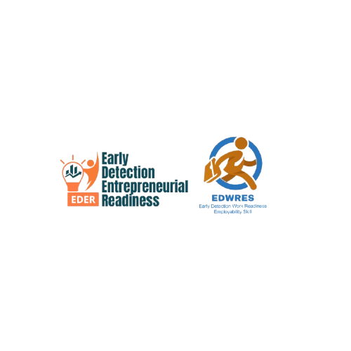

<h1 align="center">Early Detection Applications</h1>

Research-Based Intelligent Assessment Platform

Measure • Analyze • Improve • Prepare

---

## 📖 Overview

**Early Detection Applications** is a collection of intelligent assessment systems designed to evaluate an individual's readiness before entering entrepreneurship or the professional workforce.

The platform consists of two research-based applications:

- **EDER (Early Detection Entrepreneurial Readiness)**
- **EDWRES (Early Detection Work Readiness based on Employability Skills)**

Both applications were developed using scientifically validated assessment instruments derived from interviews, Focus Group Discussions (FGD), expert validation, and psychometric testing involving academics, students, alumni, practitioners, employers, and industry partners (DUDI).

---

# 💡 EDER

**Early Detection Entrepreneurial Readiness (EDER)** is an intelligent assessment platform designed to measure an individual's readiness to become an entrepreneur.

The assessment evaluates entrepreneurial readiness through several essential dimensions:

- Knowledge
- Skills
- Understanding
- Personality
- Entrepreneurial Mindset

EDER helps individuals identify their strengths and areas for improvement before starting a business, enabling them to prepare mentally, strategically, and professionally for entrepreneurial challenges.

### Target Users

- Students
- University Students
- Entrepreneurs
- Startup Incubators
- Business Training Centers
- Career Switchers

---

# 💼 EDWRES

**Early Detection Work Readiness based on Employability Skills (EDWRES)** is an intelligent assessment platform developed to evaluate an individual's readiness to enter the professional workforce.

The assessment measures competencies required by today's industries through several dimensions:

- Knowledge
- Skills
- Understanding
- Personality
- Employability Skills

EDWRES enables users to understand their level of work readiness and provides insights into competencies that should be strengthened before entering the labor market.

### Target Users

- Students
- University Students
- Fresh Graduates
- Job Seekers
- Companies
- HR Departments
- Career Development Centers

---

# 🔬 Research Foundation

Both applications are developed through comprehensive scientific research involving:

- Literature Review
- Interviews
- Focus Group Discussion (FGD)
- Expert Validation
- Psychometric Testing

The research involved:

- Lecturers
- Teachers
- Students
- Alumni
- Industry Practitioners
- Employers
- Industry Partners (DUDI)

Every assessment instrument has undergone psychometric validation to ensure reliability, validity, and objectivity.

---

# 🎯 Assessment Dimensions

| Dimension | EDER | EDWRES |
|-----------|:----:|:-------:|
| Knowledge | ✅ | ✅ |
| Skills | ✅ | ✅ |
| Understanding | ✅ | ✅ |
| Personality | ✅ | ✅ |
| Mindset | Entrepreneurial | Employability |

---

# 🌍 Vision

To empower individuals through scientifically validated assessment systems that support career development, entrepreneurship, and lifelong learning.

---

# ❤️ Acknowledgment

Special thanks to all lecturers, teachers, students, alumni, practitioners, employers, and industry partners (DUDI) who contributed to the research and validation of the assessment instruments.
